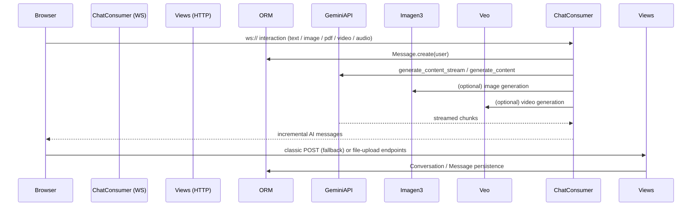

# Gemini Implementation Technical Review (Django 5.1 Project)

This document reviews **ALL** Gemini‑related capabilities implemented across the code‑base and contrasts them with the official design notes located in `implementations/Gemini/*`.

It is organised into four sections:

1. High‑level architecture & runtime data‑flow
2. Detailed per‑app / per‑file analysis (catalog, users, interaction)
3. Feature‑by‑feature compliance versus the Gemini spec docs
4. Gaps / TODO checklist with practical next steps

---
## 1 · Architecture & Runtime Flow



Key notes
- **Django 5.1** + **Channels 4** for bi‑directional streaming.
- **interaction/consumers.py** contains one `ChatConsumer` with methods that map 1‑to‑1 to the Gemini feature set.
- Streaming uses small `await self.send()` deltas but still transmits cumulative content for plain text (→ can be optimised).
- Non‑streaming fallback lives in `interaction/views.py::simulate_ai_response()`.
- Imagen 3 and Veo wrappers are thin *pass‑through* functions in `views.py`; they are **not** streamed.

---
## 2 · Detailed App / File Notes

### a. inspireai/settings.py
- Loads `GEMINI_API_KEY` from `.env` but *does not* fail‑fast when missing (handled ad‑hoc in consumer methods).
- Suggest raising `ImproperlyConfigured` in `ready()`.

### b. catalog
| file | purpose | remarks |
|------|---------|---------|
| models.py | `AITool` master table | `api_type` includes `GEMINI`; fields like `api_model`. OK. |
| views.py | tool detail pages | No Gemini logic. |

### c. users
All standard – nothing Gemini specific.

### d. interaction

| file | highlights | findings |
|------|------------|----------|
| **consumers.py** | Implements:<br>• `stream_gemini_response` (text + multimodal PDF)<br>• `stream_imagen_response` (Imagen 3)<br>• `stream_gemini_image_edit`<br>• `stream_gemini_image_understanding`<br>• `stream_gemini_video_understanding` (incl. YouTube)<br>• `stream_gemini_audio_understanding`<br>• `stream_veo_response` (video generation) | 1. **No code‐execution tool**.<br>2. Large file (>20 MB) handling only for PDFs (Files API); image/audio/video are always sent inline.<br>3. Chunks returned to client are still *cumulative* for text – N² payload growth.<br>4. Error handling good; no auto‑retry/back‑off.<br>5. Imagen and Veo responses are NOT streamed – UX inconsistent. |
| **views.py** | Duplicates non‑streaming versions of above; provides `generate_imagen_image`, `generate_veo_video`, etc. | Could DRY by moving to a service layer. |
| **templates/interaction/** | `conversation_detail.html` contains huge inline JS that supports Gemini UI toggles (image/pdf/video/audio). | Missing UI for: code‑execution enable/disable, Gemini structured‑output toggle, explicit Files API upload/delete. |
| **static/js/openai_features.js** | Handles file‑upload modal, microphone recorder, structured‑output modal, but **namespaced to OpenAI**. | Needs to be neutralised or duplicated for Gemini. |

---
## 3 · Compliance Matrix vs `implementations/Gemini/*`

| Doc file | Feature | Implementation status |
|----------|---------|-----------------------|
| gemini_text_generation.md | Plain & system‑prompted chat | ✅ Implemented via `stream_gemini_response` (model configurable). |
| gemini_prompting_strategies.md | Temperature / top‑p etc. control | ⚠️ Parameters hard‑coded (0.7/0.95). UI offers no sliders. |
| gemini_files_api.md | Upload/list/delete files | ⚠️ Partial: consumer uploads large **PDF** via `client.files.upload`, then deletes; no general upload endpoint or listing; not exposed in UI. |
| gemini_document_understanding.md | PDF summarisation & QA | ✅ Implemented (inline <20 MB, Files API otherwise). |
| gemini_image_understanding.md | Caption / object‑detect / segment | ✅ Implemented with HTML overlay for bboxes & masks. |
| gemini_image_generation.md | Imagen 3 text‑to‑image | ✅ Implemented (`stream_imagen_response`). No image‑to‑image yet. |
| gemini_image_generation.md (edit) | In‑painting / edit | ✅ `stream_gemini_image_edit` covers basic edits. |
| gemini_video_generation.md | Veo 2024 video generation | ✅ Implemented but only **text‑to‑video**; image‑to‑video param accepted but unused. No real‑time progress streaming. |
| gemini_video_understanding.md | Describe / transcript / summarise | ✅ Implemented, supports YouTube URLs. |
| gemini_audio_understanding.md | Describe / transcript / summarise | ✅ Implemented with MIME sniffing, <=20 MB limit. |
| gemini_code_execution.md | Tool‑based Python sandbox | ❌ **Not implemented at all** (no `tools=[types.Tool(code_execution=...)]`). |
| gemini_structured_output.md | JSON‑mode response | ⚠️ Modal exists but JS only stores prefs; consumer never inserts `response_mime_type="application/json"` nor schema.


### Quick Scoreboard
- Implemented ✅   9 / 12
- Partial ⚠️        3 / 12
- Missing ❌         2 / 12

---
## 4 · Missing Implementation Checklist

### 1. Code Execution (❌)
- Add a **Code‑Execution toggle** in the chat UI.
- In `stream_gemini_response` pass
  ```python
  config=types.GenerateContentConfig(
      tools=[types.Tool(code_execution=types.ToolCodeExecution)],
      ...
  )
  ```
- Surface execution result parts (executable_code, code_execution_result, inline_data) in the web‑socket stream and render in HTML.

### 2. Structured Output for Gemini (⚠️)
- Re‑use existing modal; on send, include
  ```python
  response_mime_type="application/json",
  tools=[types.Tool(
      function_declarations=[types.FunctionDeclaration(schema)]
  )]
  ```
- Validate schema on client before sending.

### 3. Fully‑fledged Files API (⚠️)
- Create `/gemini/files/upload`, `/list`, `/delete` Django views utilising `client.files.*`.
- Persist `file_id` in DB (new model `GeminiFile`).
- Allow attaching uploaded files to subsequent prompts (store in `localStorage` per conversation similar to OpenAI).

### 4. Prompting Controls (⚠️)
- Add sliders / selects for `temperature`, `top_p`, `top_k` in UI; plumb through WebSocket JSON.

### 5. Better Streaming Performance
- Send only *delta* chunk not cumulative, or accumulate on client side.
- For Imagen & Veo, poll‑or‑stream progress to avoid UX freeze.

### 6. Environment Sanity
- In `interaction/apps.py` → validate `GEMINI_API_KEY` on startup.

### 7. Testing
- Add `pytest` + `pytest‑django` tests mocking `google.generativeai` with `unittest.mock`.

---
## Recommended Next Steps

1. **Refactor** Gemini calls into `gemini_integration` Django app (mirrors `openai_integration`).
2. **Unify** front‑end: extract all inline JS from `conversation_detail.html` into `static/js/chat.js`; keep provider‑specific logic in sub‑modules (openai.js, gemini.js).
3. **Implement** the missing features above; start with Code‑Execution (biggest gap, small diff).
4. **Add** CI pipeline: `python -m pip install -r requirements.txt && python manage.py check && pytest`.
5. **Switch** Channel layer to Redis for production.

---
**Overall Conclusion**

The Gemini integration is already *feature‑rich*, covering almost all multimodal capabilities (text, PDF, image, audio, video). The main functional gaps are **Code Execution**, **generic Files API management**, and **structured‑output plumbing**, plus some UI polish and streaming efficiency tweaks.

Addressing the above will move compliance to **12 / 12** and provide a consistent user experience across both OpenAI and Gemini providers.
