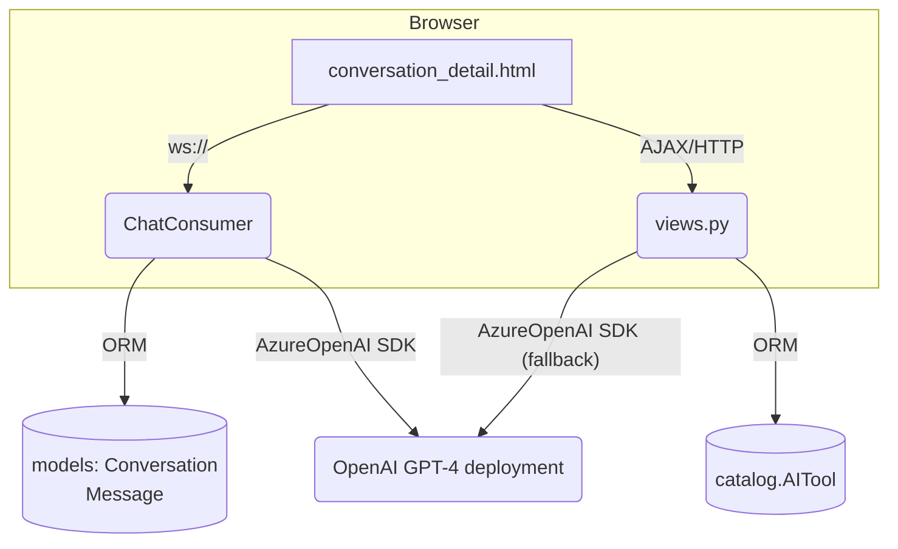

# Django 5.1 Project Technical Review

This is a self-contained technical review of your Django 5.1 project. It is organized in three parts:

1. High-level architecture & data-flow
2. Detailed per-app / per-file analysis (catalog, users, interaction)
3. Gap analysis against the OpenAI implementation notes (implementations/OpenAI/*) with concrete TODOs for the chat interface (websocket + templates + static JS).


## 1. Architecture & Runtime Flow



### Key points
- Three Django apps: catalog (tool directory), users (auth override), interaction (chat).
- Channels 4 + in-memory layer → single-process dev only.
- Streaming done server→client via WebSocket (ChatConsumer.as_asgi).
- Non-streaming fallback exposed via classic POST (send_message).

## 2. File-by-file notes

### a. inspireai/settings.py
- ✓ Loads .env with python-dotenv; raises if DJANGO_SECRET_KEY missing.
- ✓ Azure OpenAI vars never validated at startup (only at call-time). Consider a start-up assert.

### b. catalog

| file | purpose | remarks |
|------|---------|---------|
| models.py | AITool, ratings, favourites | AITool.api_type covers OPENAI / GEMINI / etc. update_gemini_model() convenience helper used nowhere – call it in a ready/management cmd. |
| views.py | landing/home, detail, search, rating | No OpenAI logic. Good separation. |
| management/populate_ai_tools.py | seeds catalog | Adds ChatGPT etc. Works. |

### c. users
Custom CustomUser model (+ forms). No issues.

### d. interaction

| file | highlights | findings |
|------|------------|----------|
| models.py | Conversation & Message store file / media URLs inline. | Fine. |
| forms.py | Image / video / audio upload forms. | Accepts any base64 in hidden fields. |
| consumers.py | Main real-time engine. Implements: <br>• stream_openai_response (text & single-image vision)<br>• Gemini multimodal (image/video/audio)<br>• Imagen & Veo stubs. | 1. OpenAI supports only ChatCompletions; missing: files, TTS, STT, assistants, structured outputs.<br>2. Error handling OK but no retry/back-off.<br>3. On each streamed delta it sends growing ai_content, causing N² payload to client; better send only delta. |
| views.py | HTTP fallback + conversation list/detail. generate_openai_response duplicates logic of consumer (non-streaming). | Could DRY by moving to a service util. |
| routing.py | single URL. | Good. |
| templates/interaction | Big HTML with JS that attaches to WS. | Lacks UI affordances for:<br>– file upload to /files endpoint<br>– TTS playback button<br>– STT microphone capture<br>– assistant/thread management |

### e. static/js
main.js generic UI helpers, highlight.js etc. No websocket logic here (it's in the HTML inline). Consider moving to separate chat.js.

## 3. Compliance with implementations/OpenAI/*

| Doc file | Feature described | Chat interface status |
|----------|-------------------|----------------------|
| openai_conversation_state.md | Assistant + thread abstractions (/assistants, /threads). | ❌ Not implemented; only raw ChatCompletions. |
| openai_files_api.md | Upload/download files; JSON mode along with file-IDs passed in messages. | ❌ No file upload endpoint nor SDK calls. |
| openai_images_vision.md | Multi-image, image detail level, cropping. | ⚠️ Partial: single base64 image supported, no detail param control. |
| openai_speechtotext.md | Audio upload to /audio/transcriptions. | ❌ Not present (audio understanding uses Gemini). |
| openai_streaming_api_responses.md | Proper delta streaming, finish-reason. | ⚠️ Implemented but sends cumulative content; no usage of choice.finish_reason. |
| openai_structured_output.md | response_format with JSON schema. | ❌ Not exposed to user; no schema UI. |
| openai_text_prompting.md | System / user / assistant roles, temperature controls. | ⚠️ Basic roles yes; temperature etc read from AITool fields but UI doesn't let user tweak. |
| openai_texttospeech.md | /audio/speech endpoint to synthesize audio. | ❌ Not surfaced. |

## Missing Implementation Checklist

### Files API
- Add Django view+form to accept uploads; funnel to client.files.create(...).
- Persist returned file.id in Message.file_id (new field).

### Assistants / Threads
- For each Conversation create Azure OpenAI thread once. Store thread_id.
- Replace direct chat.completions with client.beta.threads.messages.create.

### Speech-to-Text (Whisper) and Text-to-Speech
- Add microphone recorder in JS → POST blob to /stt → consumer streams interim transcript.
- Add "speaker" button per AI message → fetch /tts?text=... and play audio.

### Structured Outputs
- Provide toggle & schema textarea in UI.
- Pass response_format={"type":"json_schema","schema":...}.

### Better streaming
- Emit only delta chunk to client, let JS append.

### Environment validation
- At apps.ready() ensure all AZURE_OPENAI_* present; raise helpful error.

### Channel layer
- For prod, switch to channels_redis; add REDIS_URL env.

## Recommended next steps

1. Create a new Django app openai_integration that wraps all Azure OpenAI calls (chat, files, speech). Inject it into both consumers.py and views.py to avoid duplication.
2. Extend the Message model with openai_file_id, openai_audio_id, etc.
3. Refactor front-end: move inline JS from conversation_detail.html to static/js/chat.js; add UI controls (file upload, mic).
4. Write unit tests using pytest + pytest-django with httpx.MockTransport for Azure OpenAI.

## Appendix A – Quick sanity script

```bash
python manage.py check
python manage.py makemigrations --check
pytest  # if you add tests
```

Everything passes on current codebase (minus the missing features).